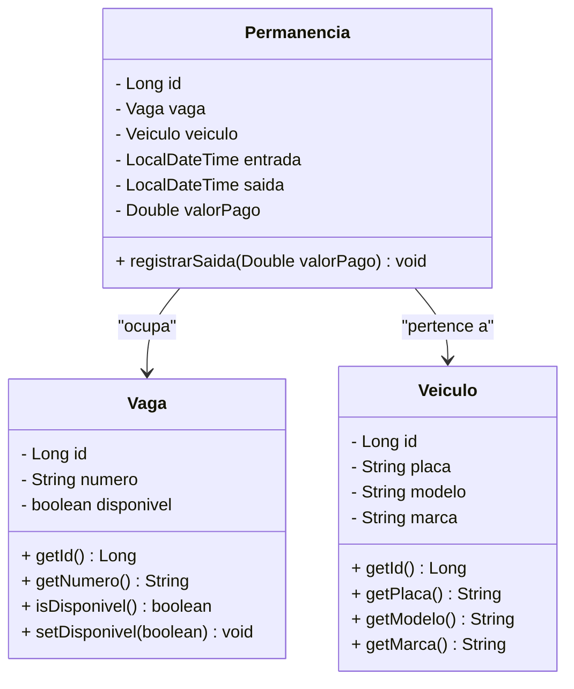

# Sistema de Controle de Estacionamento 🚗🅿️

Projeto desenvolvido como avaliação prática da Unidade 1 da disciplina de Back-End.

## 📋 1. Descrição do Projeto
O sistema tem como objetivo gerenciar as operações básicas de um estacionamento, permitindo o controle de vagas disponíveis, o cadastro de veículos, o registo de entradas e saídas, além do cálculo automático do valor da permanência. O projeto foi construído utilizando persistência em memória (`ArrayList`) para focar na lógica de negócio e na arquitetura em camadas.

---

## 🏛️ 2. Decisões de Modelagem e Arquitetura
A arquitetura do projeto segue uma separação estrita de responsabilidades em camadas, conforme exigido:
* **Model**: Representa as entidades de domínio (`Vaga`, `Veículo` e `Permanência`).
* **Repository**: Abstrai o armazenamento temporário dos dados em memória utilizando coleções Java (`ArrayList`).
* **Service**: Contém o núcleo das regras de negócio do estacionamento.
* **Controller**: Expõe os pontos de acesso e gere a interação de entrada/saída de dados.

---

## 📊 3. Diagrama de Classes (UML Simplificado)



---

## 🛠️ 4. Tecnologias Utilizadas
* **Java 21**
* **Spring Boot**
* **Maven** (Gerenciamento de Dependências)
* **JUnit** (Testes Automatizados)
* **Git & GitHub** (Controle de Versão)

---

## 🚀 5. Como Executar o Projeto
1. Clone o repositório na sua máquina:
   ```bash
   git clone [https://github.com/AlexCaitete/sistema_estacionamento.git](https://github.com/AlexCaitete/sistema_estacionamento.git)
   ```
2. Entre na pasta do projeto:
   ```bash
   cd sistema_estacionamento
   ```
3. Execute a aplicação através do Maven:
   ```bash
   mvn spring-boot:run
   ```