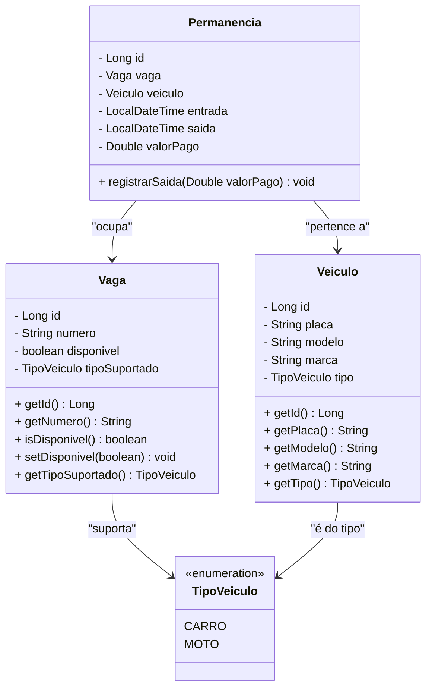

# Sistema de Controle de Estacionamento 🚗🅿️

Projeto desenvolvido como avaliação prática da Unidade 1 da disciplina de Back-End.

## 📋 1. Descrição do Projeto
O sistema tem como objetivo gerenciar as operações de um estacionamento de forma inteligente. Além de controlar vagas disponíveis, registrar entradas/saídas e calcular permanências, a aplicação foi projetada para suportar regras de negócio avançadas, como tarifas diferenciadas por tipo de veículo (Carro e Moto), emissão de relatórios de faturamento e alertas de lotação máxima. O projeto utiliza persistência em memória (`ArrayList`) para focar na arquitetura MVC em camadas.

---

## 🌟 2. Funcionalidades e Regras de Negócio
* **Tipos de Vagas e Tarifas Diferenciadas:** Sistema distingue `CARRO` e `MOTO`, aplicando preços por hora específicos para cada categoria.
* **Alerta de Lotação:** Regra que monitora e bloqueia a entrada de novos veículos caso a capacidade máxima (100%) daquele tipo de vaga seja atingida.
* **Histórico de Veículos:** Permite consultar todas as entradas e saídas passadas filtrando pela placa do veículo.
* **Relatório de Faturamento:** Serviço de fechamento para calcular o ganho total do estacionamento em um determinado período.

---

## 🏛️ 3. Decisões de Modelagem e Arquitetura
A arquitetura do projeto segue a separação estrita de responsabilidades:
* **Model**: Representa as entidades de domínio e enumerações (`Vaga`, `Veiculo`, `Permanencia`, `TipoVeiculo`).
* **Repository**: Abstrai o armazenamento temporário utilizando coleções Java (`ArrayList`).
* **Service**: Contém o núcleo das regras de negócio (cálculos, validações e alertas).
* **Controller**: Expõe os pontos de acesso (API REST) para interação com o sistema.

---

## 📊 4. Diagrama de Classes (UML Atualizado)



---

## 🛠️ 5. Tecnologias Utilizadas
* **Java 21**
* **Spring Boot**
* **Maven** (Gerenciamento de Dependências)
* **JUnit** (Testes Automatizados)
* **Git & GitHub** (Controle de Versão)

---

## 🚀 6. Como Executar o Projeto
1. Clone o repositório na sua máquina:
   ```bash
   git clone [https://github.com/AlexCaitete/sistema_estacionamento.git](https://github.com/AlexCaitete/sistema_estacionamento.git)
   ```
2. Entre na pasta do projeto:
   ```bash
   cd sistema_estacionamento
   ```
3. Execute a aplicação através do Maven:
   ```bash
   mvn spring-boot:run
   ```